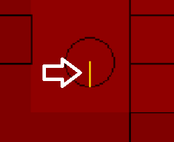
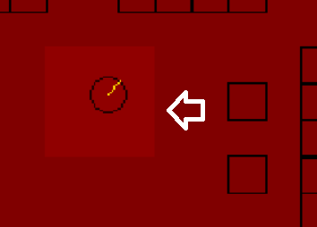

# Collision Game Demo

https://user-images.githubusercontent.com/65676644/175113565-edffbf09-1c5d-4780-95f0-119ac829a35f.mp4

Small C++ demonstration created along with the olcPixelGameEngine to improve my knowledge
in game development, specially in collision physics and client/server connections.

## Description:

The approach for this code demonstration is based on the calculation of the radius of a circle
by simply designating a point in the game space and using a function to draw it on the console:



Then the technique used to calculate statically if the circle is in contact with a tile or not
is called clamping, the clamping will give us a range of space from which we will notify the
circle if its free to move or not by measuring the distance of contact or non-contact of a 
game tile to the circle radius If there is no contact, the circle will be free to move, if 
there is, then the program will prevent the objects from overlapping, causing a displacement 
in the circles movement against the object it is colliding with.

The clamping is done by calculating the nearest point the circle's center is from the collision
in both the X and Y axis of a tile (by also calculating the bottom, top, left and right
sides of the tile, as it can be something else other than a square). Along with it, a small field
around the circle is going to calculate any proximity to a tile in the map (visually seen on
the program) so the clamping is done and calculated before the collision happens.



## controls:

- up = W
- down = S
- left = A
- right = D
- zoom in = Q
- zoom out = E
- increase velocity = SHIFT (held)
- follow object on camera = SPACE

## dependencies:

- olcPixelGameEngine.h
- olcPGEX_TransformedView.h (extension)

**Both header files can be downloaded from https://github.com/OneLoneCoder/olcPixelGameEngine**

**## DISCLAIMER:**
```diff
# The original dependencies and game architecture were taken as reference from David Barr, aka javidx9
# the comments on the code were all written by me, Luis Miguel Jaime Hernandez, by taking his videos
# and instructions as reference to learn some C++ coding, please refer to OneLoneCoder for additional
# information about the olcPixelGameEngine functionality.

# License (OLC-3)
#	~~~~~~~~~~~~~~~
#	Copyright 2018 - 2021 OneLoneCoder.com
#	Redistribution and use in source and binary forms, with or without
#	modification, are permitted provided that the following conditions
#	are met:
#	1. Redistributions or derivations of source code must retain the above
#	copyright notice, this list of conditions and the following disclaimer.
#	2. Redistributions or derivative works in binary form must reproduce
#	the above copyright notice. This list of conditions and the following
#	disclaimer must be reproduced in the documentation and/or other
#	materials provided with the distribution.
#	3. Neither the name of the copyright holder nor the names of its
#	contributors may be used to endorse or promote products derived
#	from this software without specific prior written permission.

#	David Barr, aka javidx9, ©OneLoneCoder 2019, 2020, 2021

```